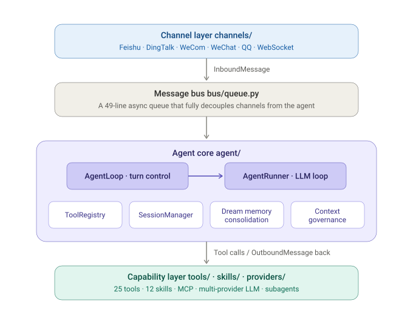

<div align="center">


**An open-source personal AI agent framework — lightweight at its core, auditable, and extensible**

Built around one readable core loop — messages come in, the LLM decides, tools execute, memory is injected on demand.

[](https://www.python.org/)
[](./LICENSE)
[](https://github.com/zhoulingquan/MiniUnicorn/releases)
[]()

[简体中文](./README.md) | **English**

</div>

---

## What is this

MiniUnicorn is a personal AI agent that runs long-term. It is not a chatbot framework, nor an orchestration engine — it is just a **small agent loop**: receive a message, call the LLM, execute tools, return the result. Everything heavy (channel adapters, tool implementations, memory strategies) hangs on the edges of the loop, keeping the core readable, auditable, and replaceable.

A note on "lightweight": here it refers to the architectural philosophy and dependency cost — the orchestration core is only about 3.4k lines, the runtime pulls in roughly 30 pure-Python dependencies, and a single process is enough to deploy; yet the full codebase, with channel adapters, 30 tool classes, and the WebUI on the edges, totals roughly 110k lines of source — far from "small-script" territory.

Built on top of [Nanobot](https://github.com/marm-io/nanobot), extending its lightweight agent core with channel adapters, a memory system, a WebUI, and multi-platform deployment.

> *"If you're not the model, you're the harness."* — once model capability crosses a threshold, what determines agent productivity is the engineering infrastructure wrapped around the model. MiniUnicorn is a complete yet minimal **Agent Harness** implementation.

## Architecture

The whole system revolves around an async message bus, in four layers:

<div align="center">



</div>

The channel layer (`channels/`, 6 adapters) is fully decoupled from the agent core by a 49-line `MessageBus`; below the core sits the capability layer of tools, skills, and LLM providers. The agent core itself can be dissected module by module against the twelve standard Agent Harness components.

## Module breakdown

| # | Harness module | MiniUnicorn implementation | Key files |
|---|---------------|---------------------------|-----------|
| 1 | Orchestration Loop | ReAct loop of AgentLoop → AgentRunner | `agent/loop.py` · `agent/runner.py` |
| 2 | Tools | 24 built-in tools + MCP + CLI apps | `agent/tools/` |
| 3 | Memory | Layered memory + two-stage Consolidator/Dream | `agent/memory.py` |
| 4 | Context Management | Strategy-based governance and multi-level compaction | `agent/context_governor.py` · `agent/runner_strategies.py` |
| 5 | Prompt Construction | Layered assembly + on-demand skill injection | `agent/context.py` · `agent/skills.py` |
| 6 | Output Parsing | Native function calling + JSON repair | `providers/*/parsing.py` |
| 7 | State Management | Atomic session persistence + Git-versioned memory | `session/` · `utils/` (GitStore) |
| 8 | Error Handling | Provider fallback + failure reflection | `providers/fallback_provider.py` · `agent/reflection.py` |
| 9 | Guardrails | Workspace confinement / SSRF / sandbox / DM approval | `security/` · `pairing/` |
| 10 | Verification Loops | Reflection lessons + plan execution | `agent/reflection.py` · `agent/planner.py` |
| 11 | Subagent Orchestration | spawn / delegate / create_agent | `agent/subagent.py` |
| 12 | Termination Conditions | Iteration caps + turn budget + user interrupt | `agent/turn_budget.py` |

### 1. Orchestration loop — the agent's heartbeat

`AgentLoop` (1,575 lines) coordinates conversation turns; `AgentRunner` (1,663 lines) drives the Thought→Action→Observation loop. This is the **only processing path** in the entire system — no plugin hook chains, no middleware stacks, no dynamic orchestration. This is a deliberate "Dumb Loop" philosophy: keep the loop plain and transparent, leave intelligence to the model, push complexity to the edges. Read these two files and you understand how the agent works.

### 2. Tools — the agent's hands

24 built-in tool classes are auto-discovered via `pkgutil`; third-party tools register through entry-point plugins:

| Category | Tools |
|----------|-------|
| Filesystem | `read_file` · `write_file` · `edit_file` · `apply_patch` · `list_dir` · `find_files` · `grep` |
| Execution | `exec` (optional sandbox, persistent sessions) · `write_stdin` · `list_exec_sessions` · `run_cli_app` (local CLIs) |
| Retrieval | `web_search` (multi-backend aggregation + cache/circuit-breaker) · `web_fetch` · `deep_research` |
| Orchestration | `cron` · `long_task` · `execute_plan` · `complete_goal` |
| Subagents | `spawn` · `delegate` · `create_agent` |
| External | `mcp_*` (multi-server) · `message` (cross-channel) · `image_generation` (multi-provider) |
| Introspection | `self` |

Every tool has an explicit schema (name / description / parameters), and execution is constrained by the security layer (module 9). External capability also has two paths that never touch the core: **MCP servers** (external process protocol) and **CLI apps** (`run_cli_app` + SKILL.md guiding the agent to use local programs like ffmpeg, pandoc, git).

### 3. Memory — state across time scales

Memory is not one giant file. It is layered, with a different medium for each kind of remembering:

| Layer | Medium | Role |
|-------|--------|------|
| Short-term session | `session.messages` | Full context of the live conversation |
| Compressed archive | `memory/history.jsonl` | Append-only, cursor-based history summaries (machine-first) |
| Long-term knowledge | `memory/structured/journal.jsonl` | Structured facts with provenance, status, and scope |
| Lessons learned | `memory/reflections.jsonl` | One-sentence lessons from failures and periodic reflection |
| Version history | `GitStore` (embedded Git) | Every change to long-term files is traceable and revertible |

Memory moves in **two stages**: the **Consolidator** summarizes the oldest safe slice into `history.jsonl` when the session approaches the context window; **Dream** runs on a schedule or via `/dream`, extracts candidate facts from new summaries and reflections, and passes them through a deterministic lifecycle into an append-only structured journal. Normal prompts recall only exact-scope active facts; candidates never enter the prompt.

### 4. Context management — fighting context rot

Context governance is strategy-based. `ContextGovernor` drives a set of replaceable `ContextStrategy` implementations:

- **Snip** — trim the oldest history slice (handing it to the Consolidator for summarization)
- **Microcompact** — compress old tool results, keeping the 10 most recent intact
- **Orphan governance** — `drop_orphan_tool_results` / `backfill_missing_tool_results` keep the message sequence structurally valid
- **AutoCompact** — proactively compress idle sessions to cut token cost and latency
- **Turn budget** — `TurnBudget` caps per-turn resource consumption

Auto-compaction is token-budget driven and skips active tasks. Third-party strategies register via the `miniunicorn.context_strategies` entry point; built-ins always take precedence.

### 5. Prompt construction — the world the model sees

Context assembly is layered: base persona (`SOUL.md`) → project instructions → tool definitions → deterministically recalled active memory and on-demand skills. Durable facts come only from the append-only structured journal and are recalled under exact scope rules.

### 6. Output parsing — from free text to structured action

Uses a native function-calling loop (rather than free-text parsing), with `json-repair` tolerantly fixing malformed JSON from the model. At the provider level, `ProviderSpec` declares behavior flags (e.g. `force_string_content`, `normalize_tool_call_ids`) to eliminate hard-coded per-provider branches; the OpenAI Responses API (GPT-5 / o-series) has its own parsing path.

### 7. State management — recoverable and debuggable

Session writes are atomic (temp file + fsync + rename), crash-safe. Long-term memory files are versioned by `GitStore` — every Dream change is a diffable, revertible commit. Scheduled tasks (`cron/`) persist and catch up after restarts; `/goal` tracks persistent goals across sessions.

### 8. Error handling — surviving inevitable errors

Errors compound in multi-step agents. MiniUnicorn's countermeasures are layered: `FallbackProvider` automatically switches to a backup model when the primary fails; tool errors return structured results for the model to self-correct; the **Reflection mechanism** has the model produce a one-sentence lesson on failure (tool error, LLM error, iteration cap) written to `reflections.jsonl`, which Dream consolidates into long-term memory — the goal is cross-turn learning: never repeat the same mistake.

### 9. Guardrails — explicit boundaries

| Boundary | Mechanism |
|----------|-----------|
| File access | `_resolve_path` confines paths to the workspace |
| Shell execution | Optional `bwrap` sandbox, workspace restriction |
| Outbound HTTP | `validate_url_target` blocks RFC1918 and cloud metadata endpoints |
| DM admission | Pairing-code approval for channel senders (`pairing/`, persisted with 0600 permissions) |

Permission architecture is separated from reasoning architecture: security checks are enforced at the tool-execution layer, never relying on the model's goodwill.

### 10. Verification loops — the line between demo and production

`execute_plan` supports plan-then-execute task decomposition; Reflection triggers not only on failure but also periodically, forming an execute → reflect → consolidate → improve loop. Plan failures (`plan_failed`) also trigger reflection, guarding against self-verification bias.

### 11. Subagent orchestration — parallelism and context isolation

`SubagentManager` manages three delegation modes: `spawn` (parallel background subtasks), `delegate` (delegate and await results), and `create_agent` (dynamically generate new agent definitions). Subagents work deeply in isolated contexts and bring only conclusions back to the main loop — both a parallelization technique and a context-management one (an extension of module 4).

### 12. Termination conditions — knowing when to stop

A layered termination system: natural termination (the model stops calling tools), iteration caps (`max_tool_iterations`, logged with `stop_reason` and a warning), turn budget (`TurnBudget` token/resource limits), and user interrupts. Abnormal termination at the cap triggers Reflection (module 8), turning "why didn't it finish" into a lesson.

## Use cases

### Good fit

- **Personal AI assistant**: connect Feishu/DingTalk/WeChat, online 24/7, memory persists across sessions
- **Development aid**: file I/O, shell execution, code search, patch application — the agent completes multi-step tasks autonomously
- **Scheduled automation**: natural-language scheduling, `/goal` persistent goals, catch-up after restarts
- **Research experiments**: readable code, auditable core loop — good for studying tool use, memory strategies, agent behavior
- **Programmatic integration**: embed via the Python SDK or the OpenAI-compatible API
- **Multi-platform deployment**: Docker, Linux services, macOS LaunchAgent

### Not a fit

- Scenarios requiring complex DAG orchestration or workflow engines
- Multi-tenant SaaS deployments
- High-sandbox environments that cannot accept filesystem/shell access

## Module quick reference

### Core runtime

| Module | Responsibility |
|--------|---------------|
| `agent/` | AgentLoop coordinates turns, AgentRunner drives the LLM loop; includes context-governance strategies and auto-compaction |
| `session/` | Session history persistence, auto-compaction, goal state tracking |
| `config/` | Pydantic config models with `${VAR}` environment variable support |
| `cron/` | Natural-language scheduled tasks, persisted, catch-up after restart |
| `bus/` | Async message bus |
| `command/` | Slash-command routing (three-tier priority/exact/prefix matching) |

### Extension modules

| Module | Responsibility |
|--------|---------------|
| `channels/` | 6 channel adapters (Feishu/DingTalk/WeCom/WeChat/QQ/WebSocket) |
| `agent/tools/` | 24 built-in tool classes (files/shell/search/MCP/subagents...) |
| `webui/` (repo root) | React 18 + Vite + TypeScript frontend (~40k lines of TS/TSX) |
| `miniunicorn/webui/` | Python gateway: HTTP/WebSocket routing, settings/channels/tools management APIs |
| `apps/` | Agent app ecosystem: CLI app catalog, installation, and extension marketplace protocol |
| `cli/` | Typer CLI commands, terminal rendering, gateway runner |
| `utils/` | Document parsing, media decoding, Git storage, and other utilities |
| `providers/` | LLM provider abstraction and OpenAI-compatible implementations |
| `security/` | Workspace confinement, SSRF protection, shell sandbox |
| `pairing/` | DM sender pairing-code approval store (persisted with 0600 permissions) |
| `api/` | OpenAI-compatible HTTP API |

## Installation

```bash
# From source (latest features)
git clone https://github.com/zhoulingquan/miniunicorn.git
cd miniunicorn
pip install -e .

# Optional extras
pip install -e ".[api,pdf,dev]"   # HTTP API / PDF parsing / tests
```

About 30 Python packages at runtime, no native build dependencies (except lxml).

## Quick start

**One command to start** — config files and the workspace are initialized automatically; the LLM API key can be configured in the WebUI after startup.

```bash
miniunicorn gateway
# → open http://127.0.0.1:8765 in your browser
```

On first launch there is no LLM configured and chat is unavailable. In the WebUI, go to **Settings → Model Configuration** and enter an API key from any OpenAI-compatible provider (DeepSeek, OpenRouter, Moonshot, etc.) — chat works right after saving, no restart needed.

**Other ways to run**

```bash
# CLI terminal chat (requires LLM configured first)
miniunicorn agent

# OpenAI-compatible API server only
miniunicorn serve

# Interactive setup wizard (optional, for pre-configuring channels etc.)
miniunicorn onboard --wizard
```

**Manual configuration** (optional): the config file lives at `~/.miniunicorn/config.json` and supports `${VAR}` environment variable substitution.

## Programmatic access

### Python SDK

```python
from miniunicorn import Miniunicorn

bot = Miniunicorn.from_config()
result = await bot.run("Summarize this repo's architecture", hooks=[MyHook()])
print(result.content)
print(result.tools_used)
```

### OpenAI-compatible API

```bash
curl http://127.0.0.1:8765/v1/chat/completions \
  -H "Content-Type: application/json" \
  -d '{
    "model": "default",
    "messages": [{"role": "user", "content": "Hello"}],
    "stream": true
  }'
```

Endpoints: `/v1/chat/completions` (SSE streaming), `/v1/models`, file upload.

## Channels

| Channel | Credential setup | WebUI QR-code login |
|---------|-----------------|---------------------|
| WebSocket | Built-in WebUI, zero config | — |
| Feishu | App ID + App Secret | ✓ |
| DingTalk | App Key + App Secret | ✓ |
| WeCom | Bot ID + Bot Secret | ✓ |
| WeChat | — | ✓ |
| QQ | App ID + App Secret | ✓ |

Every external channel supports QR-code login from the WebUI (a unified `QRCodeAuthHandler` mechanism: fetch QR code → poll scan status → credentials written automatically), or you can enter platform credentials manually. Channels are auto-discovered via `pkgutil` and extensible through entry-point plugins.

## LLM providers

Built on a unified base class, supporting:

- **OpenAI-compatible**: DeepSeek, OpenRouter, Moonshot/Kimi, MiniMax, VolcEngine, StepFun, LongCat, Azure, Bedrock, NVIDIA NIM, GitHub Copilot, LM Studio, Ollama, vLLM, and more
- **OpenAI Responses API**: GPT-5 / o-series reasoning models
- **Anthropic**: Claude family, adaptive thinking and cache optimization
- **Fallback**: automatic switch to backup models when the primary fails
- **Auto-detection**: provider identified from the API key
- **Declarative behavior config**: `ProviderSpec` behavior flags (e.g. `force_string_content`, `normalize_tool_call_ids`) declare provider quirks, eliminating hard-coded branches

## Built-in skills

Defined in Markdown + YAML frontmatter, loaded on demand:

`cron` · `document-processing` · `github` · `image-generation` · `long-goal` · `memory` · `my` · `skill-creator` · `summarize` · `tmux` · `update-setup` · `weather`

## Testing and quality

About 185 test files covering all core modules (agent 59 · channels 27 · tools 23 · utils 16 · providers 14 · cli/config/session/cron/security/pairing, etc.), `pytest-asyncio` auto mode + coverage reporting, `ruff` static checks.

```bash
pip install -e ".[dev]"
pytest
```

## Documentation

### Core docs

| Topic | Link | Covers |
|-------|------|--------|
| Quick start | [quick-start.md](./docs/quick-start.md) | Installation, onboarding, first run |
| Configuration | [configuration.md](./docs/configuration.md) | Providers, tools, channels, MCP, runtime settings |
| Chat apps | [chat-apps.md](./docs/chat-apps.md) | Detailed channel setup |
| WebUI | [../webui/README.md](./webui/README.md) | Built-in browser UI, LAN access, Vite development |
| Multiple instances | [multiple-instances.md](./docs/multiple-instances.md) | Isolated configs and workspaces |
| CLI reference | [cli-reference.md](./docs/cli-reference.md) | Core CLI commands and entry points |
| Chat commands | [chat-commands.md](./docs/chat-commands.md) | Slash commands and scheduled-task behavior |
| OpenAI API | [openai-api.md](./docs/openai-api.md) | Local API endpoints and file upload |
| Deployment | [deployment.md](./docs/deployment.md) | Docker, Linux services, macOS LaunchAgent |

### Advanced docs

| Topic | Link | Covers |
|-------|------|--------|
| Memory system | [memory.md](./docs/memory.md) | Storage, consolidation, restore mechanisms |
| Python SDK | [python-sdk.md](./docs/python-sdk.md) | Programmatic usage |
| Channel plugins | [channel-plugin-guide.md](./docs/channel-plugin-guide.md) | Custom channel plugin development |
| WebSocket | [websocket.md](./docs/websocket.md) | Real-time WebSocket protocol details |
| Image generation | [image-generation.md](./docs/image-generation.md) | Image providers, WebUI image mode |
| Introspection tool | [my-tool.md](./docs/my-tool.md) | `my` tool runtime state |

Full documentation index at [docs/README.md](./docs/README.md).

## Contributing

PRs welcome. The codebase is deliberately kept readable.

| Branch | Purpose |
|--------|---------|
| `main` | Stable releases |
| `nightly` | Experimental features |

See [CONTRIBUTING.md](./CONTRIBUTING.md).

## License

MIT — see [LICENSE](./LICENSE) and [THIRD_PARTY_NOTICES.md](./THIRD_PARTY_NOTICES.md).

---

<div align="center">

<em>Small core, extensions at the edges, memory as context.</em>

</div>
