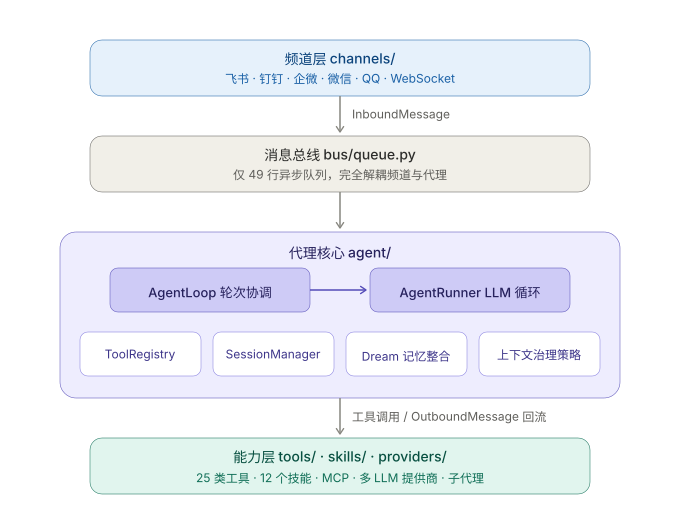

<div align="center">


**一个核心轻量、可审计、可扩展的开源个人 AI 代理框架**

围绕一个可读的核心循环构建——消息进来，LLM 决策，工具执行，记忆按需注入。

[](https://www.python.org/)
[](./LICENSE)
[](https://github.com/zhoulingquan/MiniUnicorn/releases)
[]()

**[简体中文]** | [English](./README.en.md)

</div>

---

## 这是什么

MiniUnicorn 是一个可以长期运行的个人 AI 代理。它不是聊天机器人框架，也不是编排引擎——它只是一个**小的代理循环**：接收消息、调用 LLM、执行工具、返回结果。所有重的东西（频道适配、工具实现、记忆策略）都挂在循环外围，核心保持可读、可审计、可替换。

需要说明：这里的「轻量」指架构哲学与依赖成本——编排核心仅约 3.4k 行、运行时约 30 个纯 Python 依赖、单进程即可部署；而完整代码库含频道适配、30 类工具与 WebUI 等外围能力，源码总量约 11 万行，并非「小脚本」级别。

基于 [Nanobot](https://github.com/marm-io/nanobot) 项目二次开发，在其轻量级代理核心基础上扩展了频道适配、记忆系统、WebUI 和多平台部署能力。

> *"If you're not the model, you're the harness."* —— 当模型能力跨过阈值后，决定 Agent 生产力的是包裹模型的工程化基础设施。MiniUnicorn 就是一个完整而极简的 **Agent Harness** 实现。

## 整体架构

整个系统围绕一个异步消息总线展开，分四层：

<div align="center">



</div>

频道层（`channels/`，6 个适配器）经 49 行的 `MessageBus` 与代理核心完全解耦；核心之下是工具、技能、LLM 提供商组成的能力层。而代理核心本身，可以按 Agent Harness 的十二个标准模块逐一拆解。

## 模块拆解

| #   | Harness 模块                        | MiniUnicorn 实现                     | 关键文件                                                       |
| --- | --------------------------------- | ---------------------------------- | ---------------------------------------------------------- |
| 1   | 编排循环 Orchestration Loop           | AgentLoop → AgentRunner 的 ReAct 循环 | `agent/loop.py` · `agent/runner.py`                        |
| 2   | 工具系统 Tools                        | 24 类内置工具 + MCP + CLI 应用            | `agent/tools/`                                             |
| 3   | 记忆系统 Memory                       | 分层记忆 + Consolidator/Dream 两阶段      | `agent/memory.py`                                          |
| 4   | 上下文管理 Context Management          | 策略化上下文治理与多级压缩                      | `agent/context_governor.py` · `agent/runner_strategies.py` |
| 5   | Prompt 构建 Prompt Construction     | 分层组装 + 技能按需注入                      | `agent/context.py` · `agent/skills.py`                     |
| 6   | 输出解析 Output Parsing               | 原生 Function Calling + JSON 修复      | `providers/*/parsing.py`                                   |
| 7   | 状态管理 State Management             | 原子持久化会话 + Git 版本化记忆                | `session/` · `utils/`(GitStore)                            |
| 8   | 错误处理 Error Handling               | Provider Fallback + 失败反思           | `providers/fallback_provider.py` · `agent/reflection.py`   |
| 9   | 安全防护 Guardrails                   | 工作区限制 / SSRF / 沙箱 / 频道准入        | `security/`                                                |
| 10  | 验证循环 Verification Loops           | Reflection 教训沉淀 + 计划执行             | `agent/reflection.py` · `agent/planner.py`                 |
| 11  | 子 Agent 编排 Subagent Orchestration | spawn / delegate / create_agent    | `agent/subagent.py`                                        |
| 12  | 终止条件 Termination Conditions       | 迭代上限 + 轮次预算 + 用户中断                 | `agent/turn_budget.py`                                     |

### 1. 编排循环 — Agent 的心跳

`AgentLoop`（1575 行）协调对话轮次，`AgentRunner`（1663 行）执行 Thought→Action→Observation 循环。这是整个系统**唯一的处理路径**——没有插件钩子链，没有中间件栈，没有动态编排。这是刻意的"Dumb Loop"哲学：循环保持笨拙而透明，智能留给模型，复杂性推到边缘。读这两个文件就能理解代理如何工作。

### 2. 工具系统 — Agent 的双手

24 类内置工具经 `pkgutil` 自动发现，第三方工具经入口点插件注册：

| 类别 | 工具 |
|------|------|
| 文件系统 | `read_file` · `write_file` · `edit_file` · `apply_patch` · `list_dir` · `find_files` · `grep` |
| 执行 | `exec`（沙箱可选，持久会话）· `write_stdin` · `list_exec_sessions` · `run_cli_app`（本机 CLI） |
| 检索 | `web_search`（多后端聚合 + 缓存/熔断）· `web_fetch` · `deep_research` |
| 编排 | `cron` · `long_task` · `execute_plan` · `complete_goal` |
| 子代理 | `spawn` · `delegate` · `create_agent` |
| 外部 | `mcp_*`（多服务器）· `message`（跨频道）· `image_generation`（多 provider） |
| 自省 | `self` |

每个工具有显式 schema（name / description / parameters），执行受安全层（模块 9）约束。外部能力还有两条不碰核心的接入路径：**MCP 服务器**（外部进程协议）与 **CLI 应用**（`run_cli_app` + SKILL.md 指导代理使用 ffmpeg、pandoc、git 等本机程序）。

### 3. 记忆系统 — 跨时间尺度的状态保持

记忆不是一个巨大文件，而是分层的，不同的记忆方式配不同的载体：

| 层 | 载体 | 角色 |
|----|------|------|
| 短期会话 | `session.messages` | 活跃对话的完整上下文 |
| 压缩归档 | `memory/history.jsonl` | 追加式、带游标的历史摘要（机器优先） |
| 长期知识 | `memory/structured/memory.db` | 受治理记录的结构化事实（`journal.jsonl` 仅为旧版迁移输入） |
| 教训沉淀 | `memory/reflections.jsonl` | 失败与周期性反思的一句话教训 |
| 版本历史 | `GitStore`（内嵌 Git） | 长期文件每次变更可追溯、可回滚 |

记忆经**两阶段流转**：**Consolidator** 在会话逼近上下文窗口时把最旧的安全片段摘要进 `history.jsonl`；**Dream** 按周期或 `/dream` 手动触发，从新增摘要与反思中提取候选事实，再由确定性的生命周期写入追加式结构化日志。正常提示词只召回符合精确作用域的 active 事实；候选事实和旧 Markdown 记忆文件不会整体注入。

### 4. 上下文管理 — 对抗上下文腐烂

上下文治理是策略化的，`ContextGovernor` 驱动一组可替换的 `ContextStrategy`：

- **Snip**——裁剪最旧历史片段（交给 Consolidator 摘要）
- **Microcompact**——压缩旧工具结果，保留最近 10 条完整
- **孤儿治理**——`drop_orphan_tool_results` / `backfill_missing_tool_results` 保证消息序列结构合法
- **AutoCompact**——主动压缩空闲会话，降低 token 成本与延迟
- **轮次预算**——`TurnBudget` 约束单轮资源消耗

自动压缩基于 Token 预算触发，跳过活跃任务。第三方策略可经入口点 `miniunicorn.context_strategies` 注册，内置策略永远优先。

### 5. Prompt 构建 — 模型看到的世界

上下文组装是分层的：基础人格（`SOUL.md`）→ 项目指令 → 工具定义 → 确定性召回的 active 记忆与按需技能。长期事实只来自 append-only 结构化日志，并按精确作用域召回；候选记忆不会进入正常提示词。

### 6. 输出解析 — 从自由文本到结构化行动

采用原生 Function Calling 循环（而非自由文本解析），并用 `json-repair` 容错修复模型输出的不合法 JSON。Provider 层面：`ProviderSpec` 声明式行为 flag（如 `force_string_content`、`normalize_tool_call_ids`）消除各家提供商差异的硬编码分支；OpenAI Responses API（GPT-5 / o-series）有独立解析路径。

### 7. 状态管理 — 可恢复、可调试

会话写入是原子的（临时文件 + fsync + rename），崩溃安全。长期记忆文件经 `GitStore` 版本化——每次 Dream 变更都是一个可 diff、可回滚的提交。定时任务（`cron/`）持久化存储并在重启后补执行，`/goal` 持续目标跨会话跟踪。

### 8. 错误处理 — 在必然错误中生存

多步代理的错误会累积，MiniUnicorn 的对策分层：`FallbackProvider` 在主模型失败时自动切换备用模型；工具错误结构化返回给模型自行修正；**Reflection 机制**在失败时（工具错误、LLM 错误、达到迭代上限）让模型产出一句话教训写入 `reflections.jsonl`，由 Dream 整合进长期记忆——目标是跨轮次学习，不重复同一个错误。

### 9. 安全防护 — 显式边界

| 边界 | 机制 |
|------|------|
| 文件访问 | `_resolve_path` 强制路径在工作区内 |
| Shell 执行 | 可选 `bwrap` 沙箱，工作区限制 |
| 出站 HTTP | `validate_url_target` 阻止 RFC1918 和云元数据端点 |
| 频道准入 | 各频道 `allowFrom` 白名单（精确匹配，支持 `*` 通配） |

权限架构与推理架构分离：安全检查在工具执行层强制执行，不依赖模型自觉。

### 10. 验证循环 — Demo 到生产的分水岭

`execute_plan` 支持先计划后执行的任务分解；Reflection 除失败触发外还可按间隔周期性触发，形成"执行→反思→沉淀→改进"的闭环。计划执行失败（`plan_failed`）同样触发反思，避免自我验证偏差。

### 11. 子 Agent 编排 — 并行化与上下文隔离

`SubagentManager` 管理三种委派方式：`spawn`（后台并行子任务）、`delegate`（委托并等待结果）、`create_agent`（动态生成新代理定义）。子代理在独立上下文中深度工作，只把结论带回主循环——这既是并行化手段，也是上下文管理手段（模块 4 的延伸）。

### 12. 终止条件 — 知道何时停下

分层的终止体系：自然终止（模型不再调用工具）、迭代上限（`max_tool_iterations`，触发时记录 `stop_reason` 并告警）、轮次预算（`TurnBudget` token/资源约束）、用户中断。达到上限的非正常终止会触发 Reflection（模块 8），把"为什么没做完"沉淀为教训。

## 适用场景

### 适合

- **个人 AI 助手**：接入飞书/钉钉/微信，7×24 小时在线，记忆跨会话保留
- **开发辅助**：文件读写、Shell 执行、代码搜索、补丁应用——代理可自主完成多步任务
- **定时自动化**：自然语言调度，`/goal` 持续目标，重启后补执行
- **研究实验**：代码可读，核心循环可审计，适合研究工具使用、记忆策略、代理行为
- **编程式集成**：Python SDK 或 OpenAI 兼容 API 嵌入现有系统
- **多平台部署**：Docker、Linux 服务、macOS LaunchAgent

### 不适合

- 需要复杂 DAG 编排或工作流引擎的场景
- 需要多租户隔离的 SaaS 部署
- 不接受文件系统/Shell 访问的高沙箱要求环境

## 模块速查

### 核心运行时

| 模块 | 职责 |
|------|------|
| `agent/` | AgentLoop 协调对话轮次，AgentRunner 执行 LLM 循环，含上下文治理策略与自动压缩 |
| `session/` | 会话历史持久化、自动压缩、目标状态跟踪 |
| `config/` | Pydantic 配置模型，支持 `${VAR}` 环境变量 |
| `cron/` | 自然语言定时任务，持久化，重启补执行 |
| `bus/` | 异步消息总线 |
| `command/` | 斜杠命令路由（priority/exact/prefix 三层匹配） |

### 扩展模块

| 模块 | 职责 |
|------|------|
| `channels/` | 6 个频道适配器（飞书/钉钉/企微/微信/QQ/WebSocket） |
| `agent/tools/` | 24 类内置工具（文件/Shell/搜索/MCP/子代理...） |
| `webui/`（仓库根） | React 18 + Vite + TypeScript 前端（约 4 万行 TS/TSX） |
| `miniunicorn/webui/` | Python 网关：HTTP/WebSocket 路由、设置/频道/工具管理 API |
| `apps/` | Agent App 生态：CLI 应用目录、安装与扩展市场协议 |
| `cli/` | Typer CLI 命令、终端渲染、网关运行器 |
| `utils/` | 文档解析、媒体解码、Git 存储等工具 |
| `providers/` | LLM 提供商抽象与 OpenAI 兼容实现 |
| `security/` | 工作区限制、SSRF 防护、Shell 沙箱 |
| `api_compat/` | OpenAI 兼容 HTTP API（可选 extras `[api]`） |

## 安装

```bash
# 从源码（最新特性）
git clone https://github.com/zhoulingquan/miniunicorn.git
cd miniunicorn
pip install -e .

# 可选附加依赖
pip install -e ".[api,pdf,dev]"   # HTTP API / PDF 解析 / 测试
```

运行时依赖约 30 个 Python 包，无原生编译依赖（除 lxml 外）。

## 快速开始

**一条命令启动**——配置文件和工作区会自动初始化，LLM API Key 可以启动后在 WebUI 里配置。

```bash
miniunicorn gateway
# → 浏览器访问 http://127.0.0.1:8765
```

首次启动时没有 LLM 配置，对话功能暂不可用。在 WebUI 的 **设置 → 模型配置** 里填入任意 OpenAI 兼容提供商的 API Key（DeepSeek、OpenRouter、Moonshot 等），保存后即可对话——无需重启。

**其他启动方式**

```bash
# CLI 终端对话（需要先配置 LLM）
miniunicorn agent

# 仅 OpenAI 兼容 API 服务
miniunicorn serve

# 交互式配置向导（可选，用于预配置频道等）
miniunicorn onboard --wizard
```

**手动编辑配置**（可选）：配置文件位于 `~/.miniunicorn/config.json`，支持 `${VAR}` 环境变量替换。

## 编程式接入

### Python SDK

```python
from miniunicorn import Miniunicorn

bot = Miniunicorn.from_config()
result = await bot.run("总结这个仓库的架构", hooks=[MyHook()])
print(result.content)
print(result.tools_used)
```

### OpenAI 兼容 API

```bash
curl http://127.0.0.1:8765/v1/chat/completions \
  -H "Content-Type: application/json" \
  -d '{
    "model": "default",
    "messages": [{"role": "user", "content": "你好"}],
    "stream": true
  }'
```

端点：`/v1/chat/completions`（支持 SSE 流式）、`/v1/models`、文件上传。

## 频道接入

| 频道 | 凭据接入 | WebUI 扫码登录 |
|------|---------|---------------|
| WebSocket | 内置 WebUI，无需配置 | — |
| 飞书 | App ID + App Secret | ✓ |
| 钉钉 | App Key + App Secret | ✓ |
| 企业微信 | Bot ID + Bot Secret | ✓ |
| 微信 | — | ✓ |
| QQ | App ID + App Secret | ✓ |

所有外部频道均支持在 WebUI 中生成二维码扫码登录（统一的 `QRCodeAuthHandler` 机制：获取二维码 → 轮询扫码状态 → 自动写入凭据），也可以手动填写平台凭据。频道通过 `pkgutil` 自动发现，支持入口点插件扩展。

## LLM 提供商

基于统一基类，支持：

- **OpenAI 兼容**：DeepSeek、OpenRouter、Moonshot/Kimi、MiniMax、VolcEngine、StepFun、LongCat、Azure、Bedrock、NVIDIA NIM、GitHub Copilot、LM Studio、Ollama、vLLM 等
- **OpenAI Responses API**：GPT-5 / o-series 推理模型
- **Anthropic**：Claude 系列，自适应思考与缓存优化
- **Fallback**：主模型失败自动切换备用
- **自动检测**：根据 API Key 识别提供商
- **行为声明式配置**：通过 `ProviderSpec` 的行为 flag 字段（如 `force_string_content`、`normalize_tool_call_ids`）声明 provider 特殊行为，消除代码中的硬编码分支

## 内置技能

Markdown + YAML frontmatter 定义，按需加载：

`cron` · `document-processing` · `github` · `image-generation` · `long-goal` · `memory` · `my` · `skill-creator` · `summarize` · `tmux` · `update-setup` · `weather`

## 测试与质量

约 185 个测试文件覆盖全部核心模块（agent 59 · channels 27 · tools 23 · utils 16 · providers 14 · cli/config/session/cron/security 等），`pytest-asyncio` 自动模式 + 覆盖率统计，`ruff` 静态检查。

```bash
pip install -e ".[dev]"
pytest
```

## 文档

### 核心文档

| 主题 | 链接 | 覆盖内容 |
|------|------|---------|
| 快速开始 | [quick-start.md](./docs/quick-start.md) | 安装、onboarding、首次运行 |
| 配置参考 | [configuration.md](./docs/configuration.md) | 提供商、工具、频道、MCP、运行时设置 |
| 聊天应用 | [chat-apps.md](./docs/chat-apps.md) | 频道接入详细说明 |
| WebUI | [../webui/README.md](./webui/README.md) | 内置浏览器 UI、局域网访问、Vite 开发 |
| 多实例 | [multiple-instances.md](./docs/multiple-instances.md) | 独立配置与工作区隔离 |
| CLI 参考 | [cli-reference.md](./docs/cli-reference.md) | 核心 CLI 命令与入口 |
| 聊天命令 | [chat-commands.md](./docs/chat-commands.md) | 斜杠命令与定时任务行为 |
| OpenAI API | [openai-api.md](./docs/openai-api.md) | 本地 API 端点与文件上传 |
| 部署 | [deployment.md](./docs/deployment.md) | Docker、Linux 服务、macOS LaunchAgent |

### 进阶文档

| 主题 | 链接 | 覆盖内容 |
|------|------|---------|
| 记忆系统 | [memory.md](./docs/memory.md) | 存储、整合、恢复机制 |
| Python SDK | [python-sdk.md](./docs/python-sdk.md) | 编程式调用 |
| 频道插件 | [channel-plugin-guide.md](./docs/channel-plugin-guide.md) | 自定义频道插件开发 |
| WebSocket | [websocket.md](./docs/websocket.md) | 实时 WebSocket 协议细节 |
| 图像生成 | [image-generation.md](./docs/image-generation.md) | 图像 provider、WebUI 图像模式 |
| 自省工具 | [my-tool.md](./docs/my-tool.md) | `my` 工具运行时状态 |

完整文档目录见 [docs/README.md](./docs/README.md)。

## 贡献

PR 欢迎。代码库刻意保持可读。

| 分支 | 用途 |
|------|------|
| `main` | 稳定发布 |
| `nightly` | 实验特性 |

详见 [CONTRIBUTING.md](./CONTRIBUTING.md)。

## 许可证

MIT — 见 [LICENSE](./LICENSE) 与 [THIRD_PARTY_NOTICES.md](./THIRD_PARTY_NOTICES.md)。

---

<div align="center">

<em>核心小，扩展在边缘，记忆即上下文。</em>

</div>
