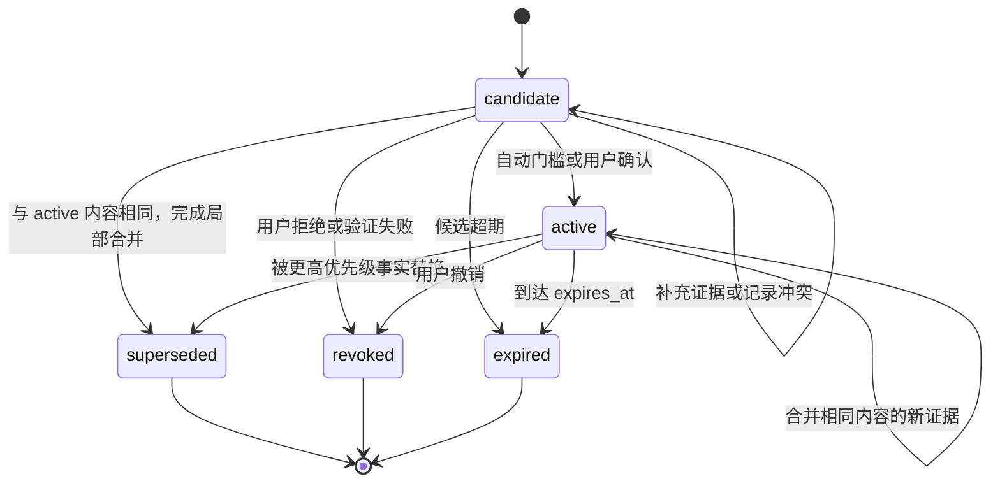

# C2 受治理的结构化记忆设计规格

**状态：** 已实施（阶段 A–E 完成，见 §19 验收与 §20 完成定义）
**日期：** 2026-08-11
**适用仓库：** MiniUnicorn
**决策基线：** 主分支不引入 embedding、向量检索、向量数据库或知识图谱

## 1. 结论

C2 将 MiniUnicorn 的长期记忆从“由 Dream 直接改写 Markdown、上下文整段注入”升级为“可验证候选、受控提升、确定性路由、原子冲突处理、可撤销审计”的结构化系统。

系统仍以工作区文件为事实源：

- Markdown 保存始终生效的身份与策略；
- append-only JSONL 保存候选、正式记忆及全部状态变更；
- GitStore 保存文件级版本历史；
- 进程内索引仅作可重建加速，不成为事实源；
- 主分支完全不提供向量索引、embedding 或“未来可切换向量”的接口预留。

## 2. 目标与非目标

### 2.1 目标

1. 每条记忆具有稳定 ID、版本、类型、作用域、受控 Tag、证据、来源等级、重要性、时效与冲突槽位。
2. 模型产出的内容先成为 `candidate`，满足确定性规则或经用户确认后才能成为 `active`。
3. 提升、替换、撤销和过期均有合法状态转换与审计理由。
4. 写入失败时 fail-closed：历史材料保留，Dream 游标不前移，候选不得被当作正式记忆召回。
5. 召回只使用权限、作用域、主体、Tag、别名、类型、时效、来源与重要性；结果完全可复现。
6. 每个召回命中均输出记忆 ID、分数与命中原因。
7. 用户明确纠正在相同冲突槽位中具有最高替换优先级。
8. 合并只发生在相同冲突槽位且内容相同的原子记忆之间，并保留全部来源 ID。
9. 旧 Markdown/JSONL 记忆可渐进迁移；迁移不删除或改写旧文件。
10. shared memory 拆成始终注入的 policy 与按任务召回的 shared facts。

### 2.2 非目标

- 不实现 embedding、向量相似度、向量数据库、混合向量检索或知识图谱。
- 不增加 PostgreSQL、SQLite、Redis 或任何新的持久化服务。
- 不允许模型直接写 `journal.jsonl`、直接决定正式状态或直接推进 Dream 游标。
- 不把全部记忆压成一段全局摘要。
- 不在 C2 中实现跨设备日志复制、分布式共识或多主写入。
- 不自动删除审计历史；后续若需要归档，必须另行设计带校验和的冷归档协议。

## 3. 设计原则

### 3.1 单一事实源

`memory/structured/journal.jsonl` 是结构化记忆的唯一事实源。每一行是一笔完整事务，一笔事务可以同时更新多条记忆。候选区与正式区在状态、API 和索引层隔离，不拆成两个需要跨文件提交的事实文件。

这项选择保证：

- candidate 提升为 active 只需追加一笔事务；
- 新记忆替换旧记忆时，新 active 与旧 superseded 在同一行提交；
- 进程中断最多产生一条不可解析的尾行，重建时进入 degraded 状态并停止写入；
- 任何索引均可从日志重放恢复。

### 3.2 先证据、后状态

模型只提出 `CandidateProposal`。系统负责验证证据、分配来源等级、计算内容哈希、检查 Tag 和合法状态转换。模型返回的 `status`、`source_level`、`revision`、`id` 一律忽略并拒绝进入持久化模型。

### 3.3 原子记忆而非叙述记忆

一条记录只表达一个可独立纠正的陈述。以下内容必须拆成两条：

> 用户喜欢深色模式，并决定项目数据库使用 PostgreSQL。

拆分后分别使用 `ui.theme` 与 `database.primary` 两个 slot。撤销其中一项不得影响另一项。

### 3.4 确定性优先

相同日志、相同 Tag 目录、相同查询、相同时间参数和相同配置必须得到相同召回顺序。召回路径中不得调用 LLM，不得依赖网络，也不得读取未声明的外部状态。

## 4. 组件边界

| 组件 | 职责 | 明确不负责 |
|---|---|---|
| `memory_models.py` | Pydantic 模型、枚举、字段规范化、状态转换表 | 文件 I/O、召回 |
| `memory_repository.py` | 事务追加、校验和、锁、日志重放、健康状态、内存索引 | 业务提升决策 |
| `memory_lifecycle.py` | 候选创建、证据验证、去重、提升、冲突替换、撤销、过期 | LLM 提取、上下文格式化 |
| `memory_recall.py` | 权限过滤、路由、评分、预算、命中原因 | 修改记忆 |
| `memory_extraction.py` | Dream 输出的严格解析与 proposal 校验 | 分配正式状态、直接写日志 |
| `memory_migration.py` | 旧数据扫描、dry-run、幂等导入、迁移清单 | 删除旧文件 |
| `MemoryStore` | 兼容门面，持有 repository/lifecycle/recall 并保留历史归档 API | 继续承载全部新逻辑 |
| `Consolidator` | 压缩对话并写 `history.jsonl` | 提升正式记忆 |
| `Reflection` | 生成有来源的候选材料 | 写 active 记忆 |
| `Dream` | 批量提取 proposal，调用 lifecycle，成功后推进游标 | 使用编辑工具改写正式记忆文件 |
| `ContextBuilder` | 组装 policy 和 `RecallResult` | 整段注入 shared facts |

## 5. 文件布局与所有权

```text
workspace/
├── AGENTS.md                         # 用户/项目策略，既有行为
├── SOUL.md                           # 身份与表达策略，继续作为 bootstrap
├── USER.md                           # 旧用户事实；迁移后只读兼容
└── memory/
    ├── MEMORY.md                    # 旧项目事实；迁移后只读兼容
    ├── history.jsonl                # Consolidator 原料流
    ├── reflections.jsonl            # Reflection 原料流
    ├── episodic.jsonl               # 旧事件流，只读兼容
    ├── procedural.jsonl             # 旧过程记忆，只读兼容
    ├── shared/
    │   ├── POLICY.md                # 明确的跨会话策略，始终注入
    │   ├── MEMORY_SHARED.md          # 旧 shared facts，只读兼容
    │   └── procedural_shared.jsonl  # 旧 shared procedures，只读兼容
    └── structured/
        ├── journal.jsonl            # 唯一结构化事实源，Git 跟踪
        ├── tags.json                # 受控 Tag 目录，Git 跟踪
        ├── migration-v1.json        # 幂等迁移清单，Git 跟踪
        ├── journal.lock             # 进程锁，不进入 Git
        └── recall-audit.jsonl       # 可选运行审计，不进入 Git，不含原始查询
```

写入者规则：

- `journal.jsonl`：仅 `StructuredMemoryRepository.append_transaction()`；
- `tags.json`：用户或显式管理命令；Dream 不得编辑；
- `POLICY.md`：用户或显式管理命令；Dream 不得自动把事实提升为 policy；
- `migration-v1.json`：仅 `LegacyMemoryMigrator`；
- `history.jsonl`：仅 Consolidator/兼容迁移代码；
- `reflections.jsonl`：仅 Reflection/清理代码。

## 6. 持久化数据模型

所有时间使用带时区的 ISO-8601 UTC，例如 `2026-08-11T08:30:00Z`。所有列表持久化前排序并去重，以保证 canonical JSON 稳定。

### 6.1 枚举

```python
class MemoryStatus(str, Enum):
    CANDIDATE = "candidate"
    ACTIVE = "active"
    SUPERSEDED = "superseded"
    REVOKED = "revoked"
    EXPIRED = "expired"


class MemoryKind(str, Enum):
    IDENTITY = "identity"
    PREFERENCE = "preference"
    CONSTRAINT = "constraint"
    DECISION = "decision"
    FACT = "fact"
    PROCEDURE = "procedure"
    RELATIONSHIP = "relationship"
    OUTCOME = "outcome"


class ScopeKind(str, Enum):
    SESSION = "session"
    PROJECT = "project"
    USER = "user"
    SHARED = "shared"


class SourceLevel(str, Enum):
    INFERRED = "inferred"
    REPEATED_EXPERIENCE = "repeated_experience"
    VERIFIED = "verified"
    CONFIRMED_DECISION = "confirmed_decision"
    EXPLICIT_CORRECTION = "explicit_correction"


class EvidenceKind(str, Enum):
    USER_MESSAGE = "user_message"
    HISTORY = "history"
    REFLECTION = "reflection"
    TOOL_RESULT = "tool_result"
    FILE = "file"
    GIT = "git"
    MANUAL = "manual"
    MODEL_INFERENCE = "model_inference"


class ActorKind(str, Enum):
    DREAM = "dream"
    USER = "user"
    MIGRATION = "migration"
    SYSTEM = "system"
```

来源数值只在系统内部使用：

| 来源 | rank | 取得条件 |
|---|---:|---|
| `explicit_correction` | 5 | `/memory-correct`，或证据验证器确认带原文的用户纠正事件 |
| `confirmed_decision` | 4 | 用户显式确认，且保留可定位的 user_message/manual 证据 |
| `verified` | 3 | file/tool/git 证据的路径、摘要哈希和内容片段均验证通过 |
| `repeated_experience` | 2 | 至少两条不同来源引用支持同一内容哈希 |
| `inferred` | 1 | 其余模型归纳；不得自动提升 |

### 6.2 `EvidenceRef`

```json
{
  "kind": "file",
  "ref": "D:/MyProject/MiniUnicorn/pyproject.toml#L1",
  "excerpt": "name = \"miniunicorn-ai\"",
  "sha256": "aaaaaaaaaaaaaaaaaaaaaaaaaaaaaaaaaaaaaaaaaaaaaaaaaaaaaaaaaaaaaaaa",
  "observed_at": "2026-08-11T08:30:00Z"
}
```

约束：

- `ref` 必须非空且不超过 512 字符；
- `excerpt` 最大 1000 字符；
- file/tool/git 的 `sha256` 必填；
- manual/user_message/history/reflection/model_inference 的 `sha256` 可空；
- 至少一条 evidence 才能创建 candidate；
- 证据合并按 `(kind, ref, sha256)` 去重，旧证据不得被覆盖。

### 6.3 `MemoryScope`

```json
{"kind": "project", "key": "project:6b5ec7b29e32"}
```

key 生成规则：

- session：`session:` + `Session.key`；
- project：`project:` + `sha256(os.path.normcase(str(Path(path).resolve())))[:12]`；
- user：`user:` + `sender_id`，无 sender ID 时为 `user:default`；
- shared：固定为 `shared:*`。

查询只携带允许访问的精确 scope 集合，不使用前缀匹配。

### 6.4 `MemoryRecord`

```json
{
  "schema_version": 1,
  "id": "mem_aaaaaaaaaaaaaaaaaaaaaaaaaaaaaaaa",
  "revision": 2,
  "status": "active",
  "kind": "decision",
  "scope": {"kind": "project", "key": "project:6b5ec7b29e32"},
  "subject": "MiniUnicorn",
  "slot": "memory.retrieval.strategy",
  "statement": "Main uses deterministic structured recall without embeddings.",
  "detail": "Markdown/JSONL remain the durable source of truth.",
  "tags": ["architecture.memory", "project.decision"],
  "aliases": ["global memory", "全局记忆"],
  "source_level": "confirmed_decision",
  "confidence": 1.0,
  "importance": 5,
  "evidence": [
    {
      "kind": "manual",
      "ref": "command:msg-42",
      "excerpt": "Use deterministic structured recall without embeddings.",
      "sha256": null,
      "observed_at": "2026-08-11T08:30:00Z"
    }
  ],
  "content_hash": "cccccccccccccccccccccccccccccccccccccccccccccccccccccccccccccccc",
  "derived_from": ["history:42"],
  "supersedes": [],
  "replacement_id": null,
  "blocked_by": [],
  "valid_from": "2026-08-11T08:30:00Z",
  "expires_at": null,
  "created_at": "2026-08-11T08:30:00Z",
  "updated_at": "2026-08-11T08:31:00Z",
  "status_reason": "manual confirmation"
}
```

字段约束：

- `id` 为 `mem_` 加 UUID4 的 32 位小写 hex；同一事实的所有 revision 共用 ID；
- `revision` 从 1 开始，每次写该 ID 必须恰好加 1；
- `subject` 1..160 字符，NFKC 规范化并 trim；
- `slot` 匹配 `[a-z0-9]+(?:[._-][a-z0-9]+)*`，1..120 字符；
- `statement` 1..500 字符，只包含一个可独立撤销的陈述；
- `detail` 最大 2000 字符；
- `tags` 为 1..12 个 `tags.json` 中存在的 canonical tag；
- `aliases` 最多 20 个，每个 1..80 字符；
- `confidence` 为 0..1；`importance` 为 1..5；
- `content_hash = sha256(canonical(kind, scope, subject, slot, statement))`；
- candidate 不进入召回；terminal 状态不再转回 active；
- `replacement_id` 只在 superseded 时填写；
- `blocked_by` 只用于仍为 candidate 的冲突项；
- `derived_from` 保存来源记录 ID、history cursor 或 reflection line，不保存不可追溯的全局摘要引用。

冲突键不单独持久化，按下式计算：

```text
conflict_key = scope.kind + "|" + scope.key + "|" +
               normalize(subject) + "|" + kind + "|" + slot
```

### 6.5 `MemoryTransaction`

```json
{
  "schema_version": 1,
  "tx_id": "mtx_bbbbbbbbbbbbbbbbbbbbbbbbbbbbbbbb",
  "recorded_at": "2026-08-11T08:31:00Z",
  "actor": "dream",
  "reason": "promote verified candidate",
  "source_batch": "history:41-42",
  "expected_revisions": {"mem_aaaaaaaaaaaaaaaaaaaaaaaaaaaaaaaa": 1},
  "operations": [
    {
      "op": "put",
      "record": {
        "schema_version": 1,
        "id": "mem_aaaaaaaaaaaaaaaaaaaaaaaaaaaaaaaa",
        "revision": 2,
        "status": "active",
        "kind": "decision",
        "scope": {"kind": "project", "key": "project:6b5ec7b29e32"},
        "subject": "MiniUnicorn",
        "slot": "memory.retrieval.strategy",
        "statement": "Main uses deterministic structured recall without embeddings.",
        "detail": "Markdown/JSONL remain the durable source of truth.",
        "tags": ["architecture.memory", "project.decision"],
        "aliases": ["global memory", "全局记忆"],
        "source_level": "confirmed_decision",
        "confidence": 1.0,
        "importance": 5,
        "evidence": [
          {
            "kind": "manual",
            "ref": "command:msg-42",
            "excerpt": "Use deterministic structured recall without embeddings.",
            "sha256": null,
            "observed_at": "2026-08-11T08:30:00Z"
          }
        ],
        "content_hash": "cccccccccccccccccccccccccccccccccccccccccccccccccccccccccccccccc",
        "derived_from": ["history:42"],
        "supersedes": [],
        "replacement_id": null,
        "blocked_by": [],
        "valid_from": "2026-08-11T08:30:00Z",
        "expires_at": null,
        "created_at": "2026-08-11T08:30:00Z",
        "updated_at": "2026-08-11T08:31:00Z",
        "status_reason": "manual confirmation"
      }
    }
  ],
  "checksum_sha256": "dddddddddddddddddddddddddddddddddddddddddddddddddddddddddddddddd"
}
```

约束：

- 一条日志行必须完整解析成一笔 transaction；
- `operations` 为 1..100 个完整 MemoryRecord 快照；
- 新 ID 的 expected revision 为 0；已有 ID 必须等于当前 revision；
- 同一 transaction 内同一 ID 最多出现一次；
- checksum 不匹配、schema 不支持或 revision 不连续均视为日志损坏；
- repository 在锁内重新检查 expected revisions，避免两个 Dream/命令并发丢更新。

## 7. 状态机



repository 拒绝状态图之外的转换。相同状态 revision 只允许：

- candidate 增加 evidence、derived_from、blocked_by 或 status_reason；
- active 合并相同 content_hash 的 evidence/derived_from；
- 不允许通过相同状态 revision 修改 active 的 statement、slot、kind 或 scope。

## 8. 候选、提升与冲突规则

### 8.1 候选创建

1. Dream/命令产生 `CandidateProposal`。
2. 系统忽略 proposal 中任何 ID、状态、revision 或 source rank。
3. 规范化 subject/slot/statement/tags/aliases。
4. 验证 Tag 和 evidence；证据无法定位时整条 proposal 被拒绝，本批次报告失败。
5. 计算 scope、content_hash、来源等级和新 ID。
6. 追加 revision 1、status candidate 的事务。
7. 追加成功后才更新内存索引。

proposal 的 `speech_act` 只是待验证声明，来源等级按证据重新计算：`explicit_correction` 和 `confirmed_decision` 必须引用 evidence catalog 中已定位的 user_message/manual 原文；`verified` 必须通过 file/tool/git 的摘要校验；支持证据不足时一律降为 `inferred`，不能按模型自报等级持久化。

### 8.2 自动提升门槛

| 来源 | 自动提升条件 |
|---|---|
| explicit correction | 至少一条已验证 user_message/manual evidence；立即允许 |
| confirmed decision | 至少一条已验证 user_message/manual evidence，confidence >= 0.90 |
| verified | 至少一条已验证 file/tool/git evidence，confidence >= 0.80，配置允许 |
| repeated experience | 至少 `min_repeated_evidence` 条不同 ref，confidence >= 0.85 |
| inferred | 永不自动提升 |

任一必填字段无效、Tag 未注册、证据不满足或 repository health 非 healthy 时，只保留已成功写入的 candidate，不提升。

### 8.3 相同内容去重

若相同 conflict_key 已有 active 且 content_hash 相同，一笔事务同时：

1. 将 active revision +1，合并 evidence 与 derived_from；
2. 将 candidate revision +1，状态改为 superseded，replacement_id 指向 active；
3. 不拼接 statement/detail，不创建摘要性新记录。

### 8.4 不同内容冲突

若相同 conflict_key 已有 active 且 content_hash 不同：

1. 新来源 rank 高于旧来源：一笔事务将新 candidate 变 active、旧 active 变 superseded；
2. 新来源 rank 低于旧来源：candidate 保持 candidate，`blocked_by=[old_id]`；
3. rank 相同：自动流程不得替换，candidate 保持 candidate；用户使用显式 replace 操作后才可替换；
4. explicit correction rank 最高，因此会替换同槽位任何非纠正来源；
5. 两条 explicit correction 冲突时，后来的纠正只有在用户显式确认 replace 后才替换，避免模型自行选择。

### 8.5 撤销与过期

- `/memory-revoke <id> <reason>` 创建新 revision，不删除旧 revision；
- active 撤销后，该 conflict_key 暂无 active，不自动复活 superseded 项；
- 到达 `expires_at` 后由 hygiene 写 expired revision；召回同时实时排除已超期但尚未写 revision 的记录；
- candidate 默认 30 天超期，可由配置调整；active 无 `expires_at` 时不因年龄自动过期。

## 9. 确定性召回

### 9.1 查询输入

`RecallQuery` 必须包含：

- `query_text`：当前用户消息；
- `allowed_scopes`：本 turn 可见的精确 scope；
- `now`：调用方显式传入的 UTC 时间；
- `token_budget`；
- `max_hits`；
- 可选 `requested_kinds`、`explicit_tags`、`explicit_ids`。

默认 allowed scopes：当前 session、当前 project、当前 user 与 shared。subagent 继承调用 turn 的 scopes，不因自身 sender ID 获得新的 user scope。

### 9.2 Tag 和别名匹配

匹配文本先做 Unicode NFKC、casefold 和空白折叠：

- ASCII tag/alias 使用单词边界；
- 含 CJK 的 tag/alias 使用规范化子串匹配；
- canonical tag 与 catalog alias 匹配分开记分；
- record 自身 alias 只能路由该 record，不能扩展其他记录；
- 召回阶段不得让 LLM补 Tag。

### 9.3 过滤顺序

1. repository health 必须为 healthy；否则只返回 policy 与 degraded 诊断；
2. status 必须为 active；
3. scope 必须精确属于 allowed scopes；
4. `expires_at` 必须为空或晚于 query.now；
5. 若 requested_kinds 非空，kind 必须匹配；
6. 除 explicit ID 外，至少命中 subject、canonical tag、catalog alias 或 record alias 中一种；
7. 进入评分与预算选择。

### 9.4 评分公式

每个 hit 的总分为以下部分之和：

| 分项 | 分数 |
|---|---:|
| explicit ID 命中 | 100，且不再叠加其他 route 分 |
| subject 原文命中 | 60 |
| canonical tag 首次命中 | 45 |
| canonical tag 额外命中 | 每个 +5，route 总分上限 60 |
| catalog alias 首次命中 | 35 |
| record alias 首次命中 | 30 |
| 额外 alias 命中 | 每个 +5，route 总分上限 45 |
| requested kind 命中 | +10，只作附加分 |
| scope：session/project/user/shared | +12/+10/+8/+6 |
| source：correction/decision/verified/repeated/inferred | +25/+20/+15/+10/+0 |
| importance | `importance * 4`，即 +4..+20 |
| freshness：<=7/30/90/>90 天 | +10/+7/+4/+0 |

同一 route 类别取最高基础分，再加该类别允许的额外命中；subject/tag/alias 三类不相加，避免堆别名刷分。最终排序键为：

```text
(-total_score, -source_rank, -importance, -updated_at_epoch, id)
```

冲突在写入阶段已经保证每个 conflict_key 最多一个 active；召回不得自行在冲突项中“猜一个”。

### 9.5 token 预算

- 默认预算 2500 tokens，默认最多 20 hits；
- 使用 `tiktoken` 的 `cl100k_base` 计算每个已格式化 hit；
- 单条记录不截断：放不下时记录 `excluded_by_budget` 并继续尝试下一条；
- 输出顺序与排序顺序一致；
- 候选数、过滤数、预算排除数与最终 token 数写入 `RecallResult`。

### 9.6 命中原因格式

上下文中的每条记录必须使用如下格式：

```text
- [mem_aaaaaaaaaaaaaaaaaaaaaaaaaaaaaaaa | decision | project] Main uses deterministic structured recall.
  Why: tag=architecture.memory(+45), source=confirmed_decision(+20),
       scope=project(+10), importance=5(+20), freshness<=7d(+10), total=105
```

不得只输出 statement 而省略 ID 和 Why。这样模型回答、用户纠正与日志审计都能引用同一稳定 ID。

## 10. shared policy 与 shared facts

- `memory/shared/POLICY.md` 是唯一新增的始终注入层；只放明确规范、禁止项和长期行为约束；
- bundled POLICY 模板只含 Markdown 注释；文件仍等同模板时不生成 prompt section；
- `memory/shared/MEMORY_SHARED.md` 与 `procedural_shared.jsonl` 在迁移时逐条变成 scope=`shared:*` 的事实/过程记录；
- shared facts 仍需命中 Tag/主体/别名，不能因为 scope=shared 就始终注入；
- USER.md 中“总是用中文回复”这类行为规范应由用户迁到 POLICY.md；迁移器不会凭语义自动移动；
- policy 受现有总注入预算保护，优先级与 bootstrap 相同；如果 policy 单独超过配置上限，启动时告警但不静默截断。

## 11. Dream、Reflection 与 Consolidator

### 11.1 Consolidator

继续只写 `history.jsonl`。新增字段 `session_key` 和 `source_refs` 时必须保持旧 reader 可读。Consolidator 不调用 lifecycle，不创建 active 记忆。

### 11.2 Reflection

继续写 `reflections.jsonl`，每条增加稳定 `reflection_id` 与可选 `source_refs`。Reflection 输出只是证据材料；即使语句看起来正确，也不能直接进入 active。

### 11.3 Dream

Dream 的新流程：

1. 读取未处理 history/reflection 与当前 active/candidate 摘要；
2. 调用 LLM 输出严格 `MemoryExtractionBatch` JSON；
3. parser 拒绝多余字段、未知 Tag、不可定位 evidence 和非原子 statement；
4. lifecycle 为每条 proposal 创建 candidate，并执行确定性自动提升；
5. 全批 proposal 均处理成功或合法空批次时推进 history/reflection 游标；
6. 任一持久化、解析或验证错误时不推进游标，并在下轮重试；
7. GitStore 提交 journal/tags/policy/migration 的实际变化；
8. Dream 不再通过 EditFileTool 改写 MEMORY.md、USER.md 或 shared facts。

合法空批次为 `{schema_version: 1, proposals: []}`，表示本批没有值得保留的原子记忆，可以推进游标。自由文本“nothing new”不算合法空批次。

## 12. 日志写入、索引重建与故障语义

### 12.1 追加协议

1. 获取 `FileLock(journal.lock, timeout=config.lock_timeout_s)`；
2. 若 repository health 非 healthy，拒绝写入；
3. 在锁内从当前 index 检查 expected revisions；
4. Pydantic 验证所有 operations、转换和 checksum；
5. canonical JSON 编码成单行 UTF-8；
6. 以 append 模式写整行和 `\n`；
7. `flush()` 后 `os.fsync()`；
8. 只有步骤 7 成功后更新内存索引并返回成功。

任何异常都抛出类型化错误，不返回伪成功 ID。

### 12.2 重建

- 启动时逐行验证 JSON、schema、checksum、expected revisions 与状态转换；
- 正常空行忽略；
- 第一条非法行出现后停止重放，health=`degraded`，保存行号和错误类别；
- degraded 时禁止所有写入和 structured recall，避免在未知状态上继续运行；
- legacy/shadow 模式可继续旧注入，governed 模式只注入 policy 并显示一次健康告警；
- 管理命令提供只读诊断，不自动删除损坏尾行。

### 12.3 GitStore

新增跟踪：

- `memory/structured/journal.jsonl`
- `memory/structured/tags.json`
- `memory/structured/migration-v1.json`
- `memory/shared/POLICY.md`

不跟踪 lock 与 recall audit。Git 提交失败不回滚已 fsync 的事务，也不阻止 Dream 游标推进；日志输出 `git_commit_failed`，下一次提交可包含累积变化。

## 13. 配置与发布模式

配置位于 `agents.defaults.structuredMemory`：

```json
{
  "mode": "shadow",
  "recallTokenBudget": 2500,
  "maxRecallHits": 20,
  "lockTimeoutS": 5.0,
  "autoPromoteVerified": true,
  "minRepeatedEvidence": 2,
  "candidateTtlDays": 30,
  "recallAuditEnabled": false
}
```

约束与语义：

| 字段 | 范围 | 语义 |
|---|---|---|
| mode | legacy/shadow/governed | 旧注入、影子召回、C2 正式召回 |
| recallTokenBudget | 256..16000 | 单 turn 结构化召回预算 |
| maxRecallHits | 1..100 | 命中上限 |
| lockTimeoutS | 0.1..30 | journal 写锁等待 |
| autoPromoteVerified | bool | 是否自动提升 verified |
| minRepeatedEvidence | 2..10 | repeated 门槛 |
| candidateTtlDays | 1..365 | candidate 自动过期天数 |
| recallAuditEnabled | bool | 是否记录不含原始查询的召回审计 |

模式行为：

| 行为 | legacy | shadow | governed |
|---|---:|---:|---:|
| 旧 MEMORY/USER/shared 注入 | 是 | 是 | 否 |
| Dream 写 structured journal | 否 | 是 | 是 |
| structured recall 计算 | 否 | 是，不注入 | 是并注入 |
| POLICY.md 注入 | 是 | 是 | 是 |
| 管理命令 | 只读状态 | 全部 | 全部 |

首次发布默认 `shadow`。只有迁移 dry-run 无错误、apply 完成且 shadow 对照测试通过，用户才把 mode 改为 `governed`。配置模型 `extra="forbid"`，任何 vector/embedding 相关字段均应被拒绝。

## 14. 旧数据迁移

### 14.1 来源映射

| 旧来源 | 新 kind | 新 scope | source level |
|---|---|---|---|
| USER.md 非空列表项 | identity/preference（按所在固定标题映射，否则 fact） | user:default | verified |
| MEMORY.md 非空列表项 | decision（标题含 Decision）否则 fact | current project | verified |
| procedural.jsonl | procedure | current project | repeated_experience |
| MEMORY_SHARED.md 非空列表项 | fact | shared:* | verified |
| procedural_shared.jsonl | procedure | shared:* | repeated_experience |
| episodic.jsonl | 不自动转 active | session/project candidate | inferred |

Markdown 每个列表项一条记录；连续段落只作为 candidate，禁止把整篇文件导成一条 active 叙述。

标题与 Tag 使用以下确定性映射，比较时做 NFKC 和 casefold，不调用 LLM：

| 来源/标题集合 | kind | tag |
|---|---|---|
| USER: preference/preferences/偏好/喜好 | preference | user.preference |
| USER: 其他标题或无标题 | identity | user.identity |
| MEMORY: decision/decisions/决策/决定 | decision | project.decision |
| MEMORY: constraint/constraints/约束/限制 | constraint | project.constraint |
| MEMORY: requirement/requirements/需求/要求 | fact | project.requirement |
| MEMORY: 其他标题或无标题 | fact | project.fact |
| procedural.jsonl | procedure | workflow.procedure |
| MEMORY_SHARED.md | fact | shared.fact |
| procedural_shared.jsonl | procedure | workflow.procedure + shared.fact |
| episodic.jsonl | outcome | session.event |

### 14.2 幂等键

```text
legacy_key = sha256(relative_path + "\n" + source_locator + "\n" + normalized_content)
```

`migration-v1.json` 保存每个 legacy_key 对应的 memory ID。重跑时已成功项跳过，失败项重试。导入按每批最多 100 operations 提交。只有全部来源扫描完成才写 `completed_at`。

### 14.3 安全要求

- dry-run 不创建文件、不初始化 Git、不改变游标；
- apply 不删除、不截断、不改写旧文件；
- 无法解析、超过字段上限、未知编码或没有原子边界的项进入报告，不被静默丢弃；
- governed 模式启动前必须存在 `completed_at`；否则拒绝切换并给出命令提示。

## 15. 管理接口

必须提供以下命令：

```text
/memory-status
/memory-list [candidate|active|superseded|revoked|expired]
/memory-show <id>
/memory-promote <id> [--replace <active-id>]
/memory-revoke <id> <reason>
/memory-correct <subject>|<slot>|<statement>
/memory-migrate --dry-run
/memory-migrate --apply
```

要求：

- 所有修改命令 actor=`user`，reason 必填并进入事务；
- list 默认最多 20 条并显示 ID/status/kind/scope/source/statement；
- show 显示全部 revision、evidence 和替换链；
- status 显示 mode、health、最后有效行、各状态计数、迁移状态和最近写入错误；
- promote 遇到同槽位冲突时必须要求 `--replace`，不得隐式选择；
- correct 直接创建 explicit_correction candidate，再按规则原子提升；
- 命令不得回显 evidence 中超过 200 字符的 excerpt。

## 16. 可观测性与审计

每次写事务记录：`tx_id`、actor、reason、source_batch、record IDs、旧/新 revision 与状态。结构化日志事件至少包括：

- `memory_repository_loaded`
- `memory_repository_degraded`
- `memory_transaction_committed`
- `memory_transaction_rejected`
- `memory_candidate_created`
- `memory_candidate_promoted`
- `memory_conflict_blocked`
- `memory_record_superseded`
- `memory_record_revoked`
- `memory_recall_completed`
- `memory_dream_batch_failed`
- `memory_migration_completed`

recall audit 开启时只保存：时间、scope key 哈希、命中 ID/分数/reason code、过滤计数和 token 数；不保存 query_text、statement 或 evidence excerpt。文件按 1000 行保留尾部，明确标记为可删除运行日志。

## 17. 测试矩阵

### 17.1 模型与状态

- 枚举、长度、时间、ID、slot、Tag、evidence 校验；
- canonical normalization 与 content_hash 在输入顺序变化时稳定；
- 合法转换全部通过，非法转换全部拒绝；
- terminal 状态不可复活；
- active 相同状态 revision 不能修改事实字段。

### 17.2 Repository

- 空日志、单事务、多 operation 重建；
- checksum、JSON、schema、revision、expected revision 损坏进入 degraded；
- 尾行截断不得被跳过后继续写；
- 并发 expected revision 只有一方成功；
- fsync/append/lock 失败不更新内存 index；
- multi-record 替换重放后保持原子结果；
- GitStore 跟踪新增文件但忽略 lock/audit。

### 17.3 Lifecycle

- 五种来源等级门槛；
- inferred 永不自动提升；
- 相同 content_hash 局部合并并保留来源；
- 高 rank 替换低 rank；低 rank 被 blocked；同 rank 要求显式 replace；
- correction 替换既有 decision；两条 correction 不自动互相覆盖；
- 撤销不复活旧项；candidate 和 active 正确过期；
- 任一 repository 异常时不报告 promotion 成功。

### 17.4 Recall

- scope 不泄漏；candidate/terminal/expired 不召回；
- ASCII 边界与 CJK 子串；subject/tag/catalog alias/record alias 路由；
- 评分每一分项、排序和 ID 最终 tie-break；
- 不同插入顺序得到相同结果；
- token 预算跳过放不下的大记录并继续；
- 每个 hit 必有 ID、score、Why；
- recall 路径 mock provider 并断言零 LLM/网络调用。

### 17.5 Dream 与故障

- 合法空 proposals 推进游标；
- 非 JSON、额外字段、未知 Tag、坏 evidence 不推进游标；
- candidate 成功但 promotion 写失败时不推进游标，重试幂等；
- Dream 无 EditFileTool 权限修改长期 facts；
- Git 提交失败不否定已持久化事务；
- Reflection 只能成为 evidence，不能直接 active。

### 17.6 迁移与模式

- dry-run 零写入；apply 幂等；中断后续跑；
- 每个旧 bullet 独立导入；无法解析项出现在报告；
- legacy/shadow/governed 三种注入行为；
- governed 未完成迁移时拒绝启动；
- shared facts 不再整段注入，POLICY 始终注入；
- 原有 context、Dream、session、command 回归测试通过。

## 18. 性能边界

- 目标规模：10,000 个当前记录、100,000 条事务时启动重放可用；本阶段不承诺毫秒级冷启动；
- 单 turn 召回只访问进程内索引，不重复全量读 journal；
- 标签、主体、alias 和 scope 建倒排集合；交集/并集后再评分；
- 写入频率低于召回频率，优先保证写入审计性与召回确定性；
- 不以性能理由引入向量库或数据库；达到性能瓶颈后先测量，再设计可校验 snapshot。

## 19. 分阶段验收

### 阶段 A：结构与持久化

- 模型、事务日志、重建、健康状态与索引完成；
- repository 单元测试全绿；
- 尚不接入 Context/Dream。

### 阶段 B：治理生命周期

- candidate、promotion、conflict、revoke、expire 完成；
- fail-closed 与并发测试全绿；
- 管理服务可直接调用。

### 阶段 C：确定性召回

- 路由、评分、预算、Why 输出完成；
- 召回零 LLM 调用证明测试全绿；
- shadow 模式可生成对照日志。

### 阶段 D：Dream 与迁移

- Dream 严格提取和游标语义完成；
- dry-run/apply 迁移完成；
- shadow 运行不改变旧 prompt 行为。

### 阶段 E：governed 切换

- ContextBuilder 只注入 POLICY + RecallResult；
- 旧 shared facts 不再始终注入；
- 管理命令和文档完成；
- 全量测试与 C2 边界测试通过。

## 20. 完成定义

C2 只有同时满足以下条件才算完成：

1. 所有新结构化事实写入均经过 repository 和 lifecycle；
2. candidate 从任何路径都无法进入模型上下文；
3. 同槽位 active 唯一性由事务测试证明；
4. 写失败、日志损坏和 Dream 解析失败均 fail-closed；
5. governed 模式不整段注入 MEMORY.md、USER.md、MEMORY_SHARED.md 或 procedural JSONL；
6. 每个 recall hit 都有稳定 ID 与 Why；
7. 迁移可 dry-run、可中断重试且不修改旧文件；
8. GitStore 可审计结构化日志变化；
9. 所有 C2 与既有回归测试通过；
10. 依赖、源码、配置和文档中没有 embedding、vector store、向量召回或知识图谱实现入口。
